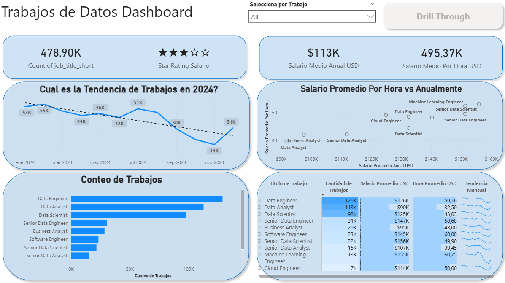
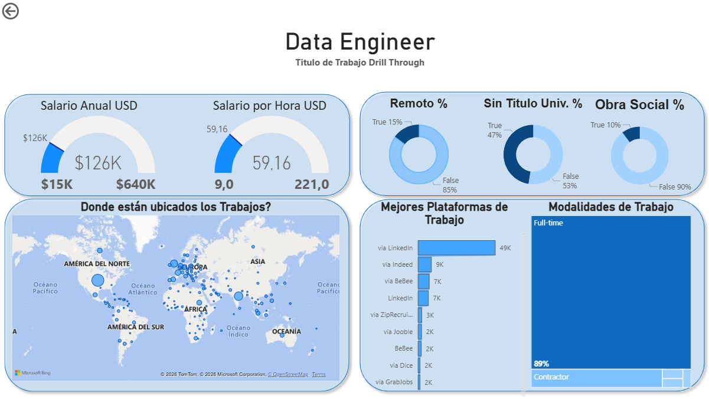

# 📊 Dashboard del Mercado Laboral de Trabajo de Datos (2024)

## 📌 Descripción del Proyecto

Este proyecto analiza **millones de ofertas laborales del año 2024** relacionadas con el sector de datos, incluyendo perfiles como:

- Data Engineer  
- Data Analyst  
- Data Scientist  
- Machine Learning Engineer  
- Business Analyst  

El objetivo es transformar datos masivos del mercado laboral en información clara y accionable sobre:

- Demanda por rol  
- Tendencias salariales  
- Modalidad de trabajo  
- Distribución geográfica  

El proyecto fue desarrollado completamente en **Power BI**.

---

## 🛠 Habilidades Utilizadas

### 🔹 Transformación de Datos (ETL) – Power Query
- Limpieza y normalización de datos  
- Manejo eficiente de millones de registros  
- Estandarización de salarios (anual vs por hora)  
- Eliminación de valores nulos e inconsistencias  

### 🔹 Modelado de Datos
- Creación de relaciones  
- Columnas calculadas y medidas  
- KPIs con DAX  
- Análisis de tendencias  

### 🔹 Visualización y Análisis
- Tarjetas KPI  
- Tendencia mensual 2024  
- Comparación salarial  
- Drill-through por puesto  
- Mapa geográfico  
- Filtros interactivos  

---

## 📊 Estructura del Dashboard

### 🟦 Página 1: Vista General del Mercado

Presenta una visión macro del mercado laboral en datos durante 2024.

#### Información Destacada:

- ~478K ofertas analizadas  
- Salario promedio anual: $113K USD  
- Salario promedio por hora: $49.37 USD  
- Data Engineer lidera la demanda  

Permite comparar rápidamente demanda y salarios entre roles.

---

### 🟦 Página 2: Análisis Detallado por Puesto (Drill Through)

Permite profundizar en un puesto específico.

Ejemplo: **Data Engineer**

Incluye:

- Rango salarial anual  
- Salario promedio por hora  
- % de trabajo remoto  
- % que no requiere título universitario  
- Beneficios  
- Distribución geográfica  
- Plataformas de contratación  
- Modalidad laboral (Full-time vs Contractor)  

Facilita el análisis detallado para toma de decisiones profesionales.

---

## 📈 Conclusiones

- Data Engineer es el rol con mayor demanda en 2024.
- Los perfiles orientados a ingeniería presentan mayor salario promedio.
- La mayoría de los puestos son Full-time.
- LinkedIn es la plataforma con mayor volumen de publicaciones.
- El trabajo remoto existe pero no es predominante.

---

## 🎯 Valor del Proyecto

Este dashboard permite:

- Analizar el mercado laboral de datos  
- Comparar salarios por rol  
- Detectar tendencias  
- Apoyar decisiones de carrera  
- Generar inteligencia de mercado  

---

## 🚀 Aprendizajes

- Manejo de grandes volúmenes de datos  
- Construcción de dashboards interactivos  
- Modelado con DAX  
- Generación de insights a partir de datos reales  

---

### 👤 Autor

Juan Camellini  
Data Analyst en formación | Python | SQL | Power BI